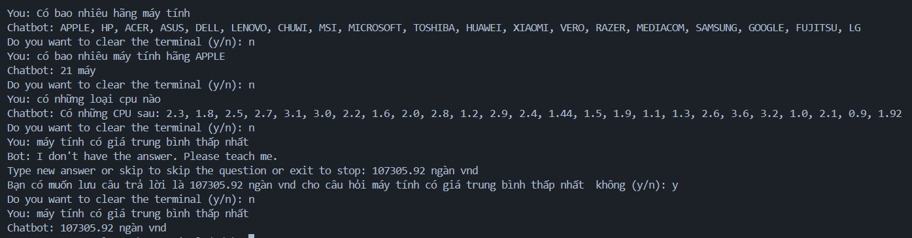

# Chatbot trả lời câu hỏi từ người dùng, tự học câu trả lời từ người dùng

## Một số ví dụ
- You: Có bao nhiêu hãng máy tính
- Chatbot: APPLE, HP, ACER, ASUS, DELL, LENOVO, CHUWI, MSI, MICROSOFT, TOSHIBA, HUAWEI, XIAOMI, VERO, RAZER, MEDIACOM, SAMSUNG, GOOGLE, FUJITSU, LG
- You: có bao nhiêu máy tính hãng APPLE
- Chatbot: 21 máy
- You: Máy tính có giá đắt nhất có tên máy tính là gì?
- Chatbot: Gaming
- You: Máy tính có giá đắt nhất có kích thước màn hình là gì?
- Chatbot: 17.3
# Cài đặt
```c
pip install -r setup.txt
```

# Cấu trúc project
- Dữ liệu câu hỏi: data/json/question_data.json
- Dữ liệu csv: data/csv/
- DataCleaning.ipynb: file làm sạch dữ liệu trong tập csv
- prepare_data_csv.py: file chuẩn bị tập câu hỏi cho question_data.json
- chatbot_main.py: file chương trình chatbot

# Chạy chương trình
```c
python chatbot_main.py
```

# Demo và kết quả




